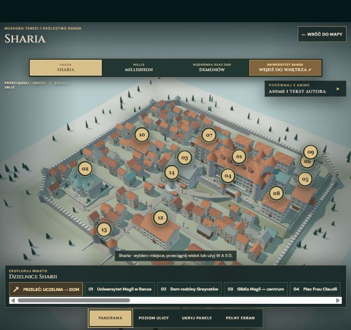

# Mushoku — interaktywny atlas świata

[Otwórz atlas](https://pirytos25-creator.github.io/Mushoku/)

Fanowska mapa i kompendium świata **Mushoku Tensei** z osobnymi scenami 3D Sharii, Millishion, Kontynentu Demonów, Rikaris i wnętrz Uniwersytetu Ranoa. Można przełączać sezony, wejść do regionów, śledzić wędrówkę oraz sterować kamerą myszą i klawiszami W A S D.

## Uruchomienie

To strona statyczna. Otwórz [GitHub Pages](https://pirytos25-creator.github.io/Mushoku/) albo uruchom lokalny serwer w tym katalogu, na przykład `python -m http.server 8080`, i wejdź na `http://localhost:8080/`. Sceny 3D wymagają WebGL.

Plik `bundle.js` w tej wersji odwołuje się do modeli GLB i mapy przez ścieżki względne. Dzięki temu repozytorium mieści się w limitach GitHub, a strona działa pod adresem projektu `/Mushoku/`.

## Rozwój

Kod aplikacji znajduje się w `src/`. Po zmianie kodu uruchom `npm install` i `npm run build`. Wynik trafi do `bundle.js` w katalogu głównym.

## Źródła i zakres dokładności

To **nieoficjalna rekonstrukcja fanowska**, niezwiązana z autorami ani producentami anime. Modele 3D i drobny układ ulic są opracowaniem własnym na podstawie opisów powieści i oficjalnych materiałów anime; nie są siatkami wyciągniętymi z produkcji. Lokalizacje bez dokładnej kotwicy w źródłach zaznaczono jako przybliżone. Szczegółowe odniesienia są w katalogu [`zrodla/`](zrodla/).

- [Mapa z tomu 4 light novel](https://www.baka-tsuki.org/project/index.php?title=File%3AMushoku_Tensei_Vol.4_map_translated.jpg)
- [Oficjalne opisy anime](https://mushokutensei.jp/story/)
- [Opis Sharii w tekście autora](https://ncode.syosetu.com/n9669bk/75/)

Oficjalne kadry otwierają się przez linki do źródeł zewnętrznych; nie są częścią tego repozytorium. Użyta biblioteka Three.js ma [licencję MIT](THREE-LICENSE.txt).
